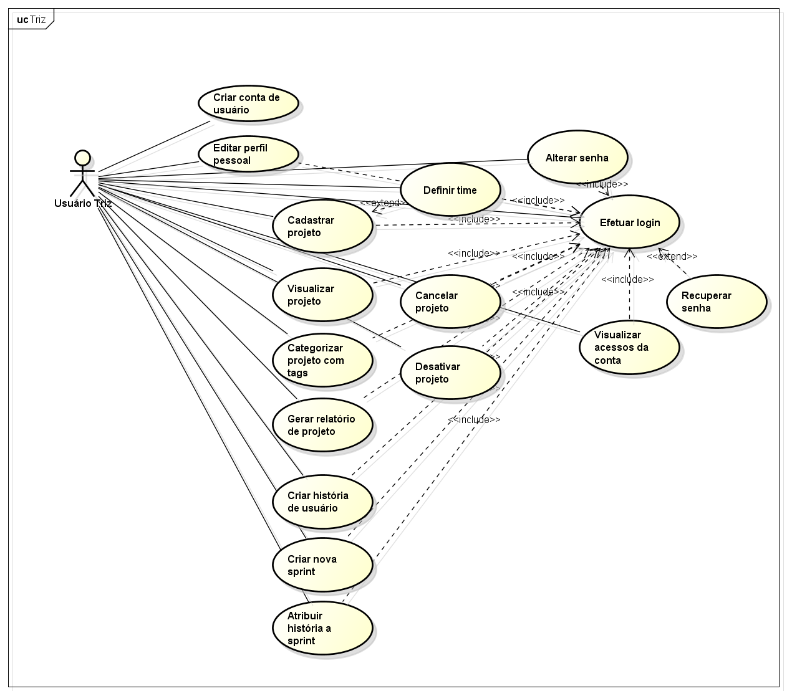

# TRIZ

#### Resumo

O desenvolvimento de software requer uma abordagem sistematizada e dinâmica. A dificuldade em conciliar esses fatores pode trazer problemas relacionados a prazos e custos. Este trabalho propõe uma ferramenta CASE que auxilie nos processos gerenciais, visando eficiência e eficácia. O aplicativo foi programado para web com design responsivo, por meio das linguagens HTML, CSS, PHP e SQL. A metodologia de desenvolvimento foi o Scrum. O projeto foi submetido a controle de versões e a testes. O resultado alcançado consiste na aplicação online denominada Triz. Espera-se com isso, fornecer um meio para a diminuição do índice de fracasso de projetos e aumento da qualidade de softwares produzidos. Além de familiarizar pequenas e médias equipes com a sistematização de tarefas e responsabilidades, bem como com outros conceitos de gerência e Engenharia de Software.

#### *Abstract*

*A software development program requires a systematic and dynamic approach. The difficulty in reconciling these factors can lead to problems related to time and costs. This project proposes a CASE tool that assists a management process efficiently and effectively. The application has been programmed on the web with responsive design, through the languages HTML, CSS, PHP and SQL. The development methodology was Scrum. The project was submitted to a version control and testing. The result achieved is the online application Triz. It is expected thereby the decrease of the failure rate in the projects and the increase of the quality of the software programs produced. Besides of this it familiarizes small and medium teams with the systematization of the tasks and responsibilities. In it was used other concepts of management and Software Engineering*

## Funcionalidades


**Figura:** Diagrama de Casos de Uso do Triz  
**Fonte:** O autor (2016)

## Linguagens, Ferramentas e Bibliotecas

- HTML, CSS, PHP e SQL (MySQL)
- Editor de texto básico, Navegadores e Trello
- XAMPP, Composer, Astah Community e MySQL Workbench
- Bootstrap, TWIG, Silex

## Execução do Projeto

### Ambiente de Desenvolvimento

Executar o seguinte comando dentro do diretório Triz:

`php -S localhost:8080 web/index.php`

### Ambiente Operacional

Incluir o arquivo `.htaccess` no diretório raiz:

```
<IfModule mod_rewrite.c>
    Options -MultiViews    
    RewriteEngine On
    RewriteBase /web
    RewriteCond %{REQUEST_FILENAME} !-f
    RewriteRule ^ index.php [QSA,L]
</IfModule>
```

### Dependências

`triz/vendor` - framework e bibliotecas externas  
`localhost/static` - arquivos CSS, scripts Javascript e imagens

## Discussão dos Resultados
Com este trabalho, concebeu-se uma ferramenta CASE denominada Triz, que busca auxiliar efetivamente a pequenas e médias equipes alcançarem melhores rendimentos em seus projetos, através de um ambiente intuitivo e agradável para o gerenciamento de tarefas e responsabilidades. E, consequentemente, alcançar projetos e produtos com mais qualidade.  

Espera-se com isso, fornecer um meio para a diminuição do índice de fracasso de projetos e aumento da qualidade de softwares produzidos. Além de familiarizar pequenas e médias equipes com a sistematização de tarefas e responsabilidades, bem como com outros conceitos de gerência e Engenharia de Software.

## Referências

BARRUCHO, L. G. **IBGE:** Metade dos brasileiros estão conectados à internet; Norte lidera em acesso por celular. 2015. Disponível em:
<http://www.bbc.com/portuguese/noticias/2015/04/150429_divulgacao_pnad_ibge_lgb>. Acesso em: 12 out. 2015.

BRASIL. Ministério da Ciência Tecnologia e Inovação. Secretaria de Política de Informática. **A História da Tahini-Tahini:** Melhoria de Processos de Software com Métodos Ágeis e Modelo MPS. 9. ed. Brasília: [s.n.], 2013. Disponível em: <http://www.mct.gov.br/upd_blob/0228/228094.pdf>. Acesso em: 5 set. 2016.

______. Ministério da Ciência e Tecnologia. Secretaria de Política de Informática. **Pesquisa de Qualidade no Setor de Software Brasileiro 2009.** [S.l.: s.n., 2010]. Disponível em: <http://www.mct.gov.br/upd_blob/0214/214567.pdf>. Acesso em: 10 out. 2016.

CARVALHO, B. V. de; MELLO, C. H. P. Aplicação do método ágil scrum no desenvolvimento de produtos de software em uma pequena empresa de base tecnológica. **Gest. Prod.**, São Carlos, v. 19, n. 3, p. 557-573, 2012. Disponível em: <http://www.scielo.br/scielo.php?script=sci_arttext&pid=S0104-530X2012000300009&lng=en&nrm=iso>. Acesso em: 18 out. 2016. http://dx.doi.org/10.1590/S0104-530X2012000300009.

COCKBURN, A. et al. **Manifesto para o desenvolvimento ágil de software.** 2001. Disponível em: <http://www.manifestoagil.com.br/>. Acesso em: 21 nov. 2016.

FERNANDES, A. A.; TEIXEIRA, D. de S. **Fábrica de Software.** São Paulo: Atlas, 2004.

GOMES, A. F. **Agile:** desenvolvimento de software com entregas frequentes e foco no valor de negócio. São Paulo: Casa do Código, 2013.

MAXIMIANO, A. C. A. **Administração de Projetos:** Como Transformar Idéias em Resultados. 2. ed. São Paulo: Atlas, 2006.

PHILLIPS, J. **Gerência de Projetos de Tecnologia da Informação.** 6. ed. Rio de Janeiro: Elsevier, 2003.

PRESSMAN, R. S. **Engenharia de software.** 6.ed. Porto Alegre: Bookman, 2006.

REZENDE, D. A. **Engenharia de software e sistemas de informação.** 3.ed. Rio de Janeiro:
Brasport, 2005.

SABBAGH, R. **Scrum:** gestão ágil para projetos de sucesso. São Paulo: Casa do Código, 2013.

SEVERINO, A. J. **Metodologia do trabalho científico.** 23. ed. rev. e atual. São Paulo: Cortez Editora, 2007.

SOMMERVILLE, I. **Engenharia de software.** 8. ed. São Paulo: Pearson Addison-Wesley,
2007.

SUTHERLAND, J. **Scrum:** a arte de fazer o dobro na metade do tempo. São Paulo: LeYa, 2014.
